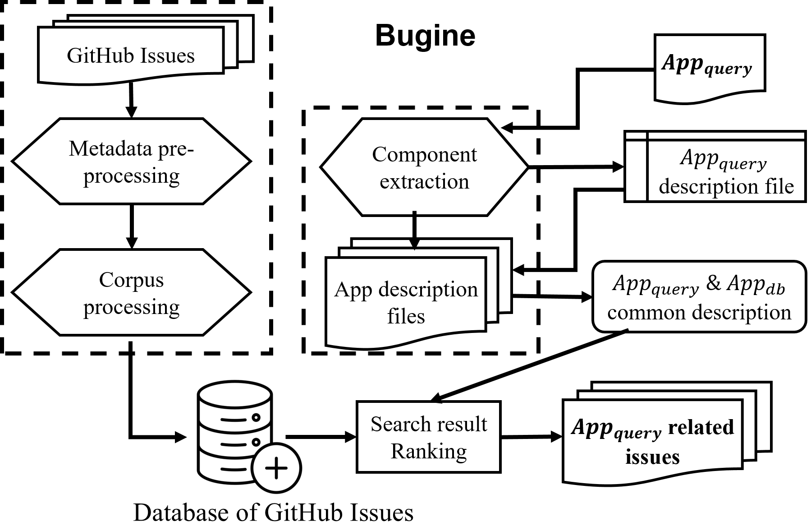
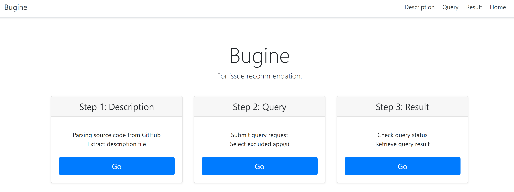
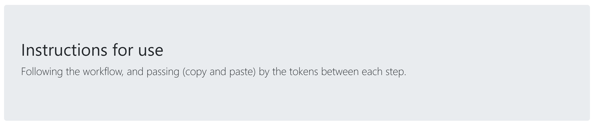
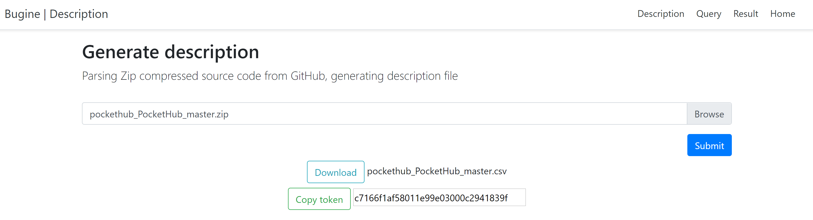
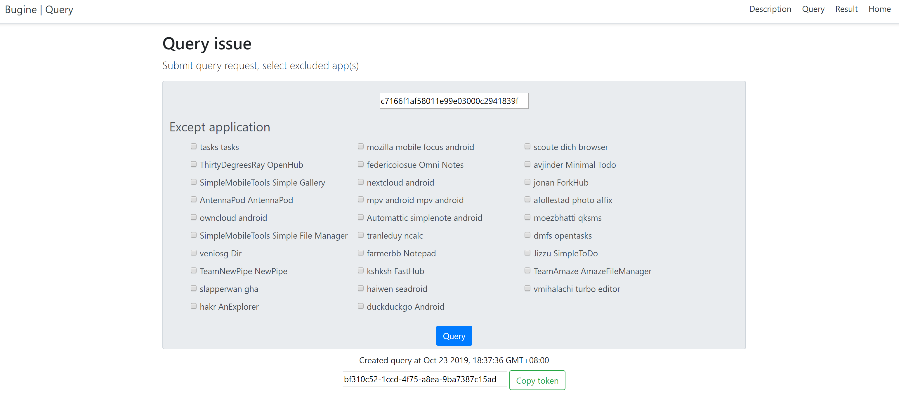
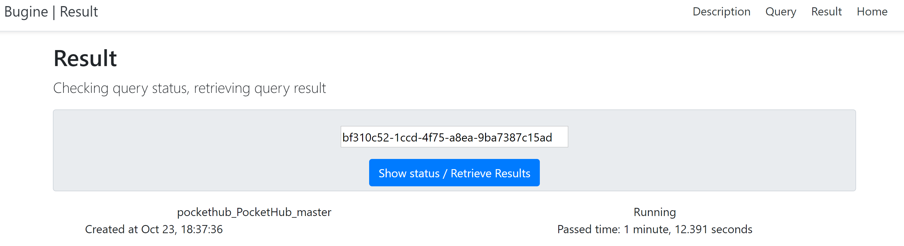
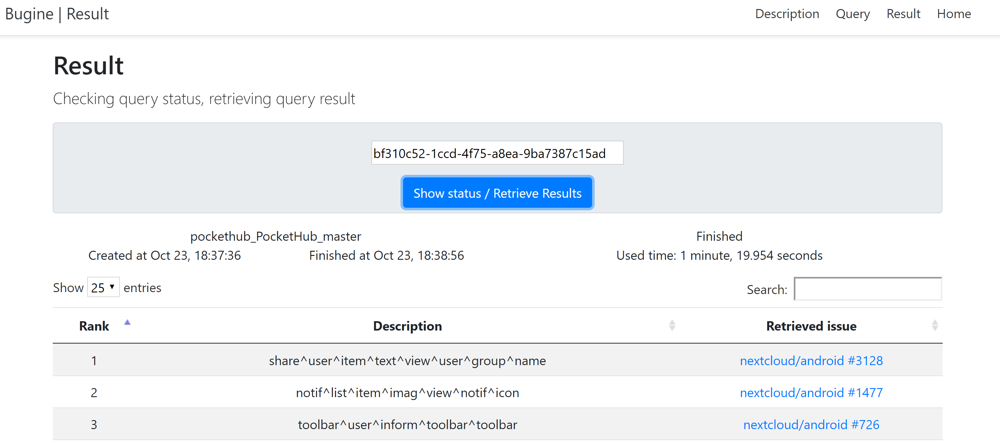

# Bugine


[Bugine](https://bugine.github.io/) is a prototype of issue recommendation system that aims to provide relevant GitHub issues for Android apps based on their UI description.



## How to run (Only for Linux)
```bash
# setup redis
sudo apt-get update
sudo apt-get install redis-server

# set redis password
sudo vim /etc/redis/redis.conf
# add a line: "requirepass mypass"
systemctl restart redis-server.service

# setup python env
pip install virtualenv
virtualenv venv
source venv/bin/activate
pip install -r requirements.txt

# setup nltk
python setup_nltk.py
# if above fail to run
tar zxvf nltk_data.tar.gz -C ~

# run celery Broker
celery -A tasks worker --loglevel=info
# run web-server
python app.py

# access
http://127.0.0.1:5000
# or
http://YOUR_SERVER_IP:5000
```

## Screen-shots

### Home




### Step 1 Description


### Step 2 Query


### Step 3 Result

#### waiting



#### done

